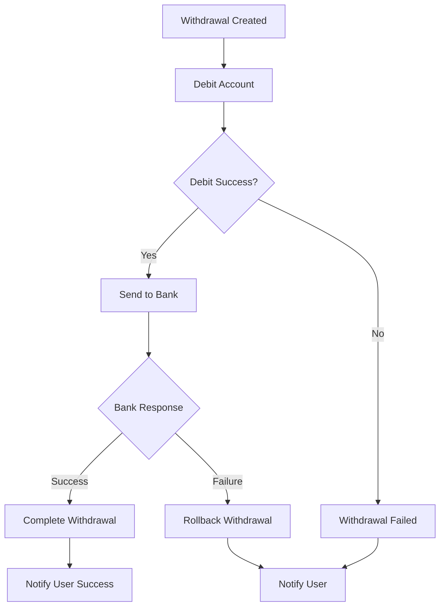

# Clean Architecture Implementation

This project follows Clean Architecture principles as defined by Robert C. Martin (Uncle Bob). The architecture is organized into concentric layers with dependencies pointing inward.

## Architecture Layers

### 1. Domain Layer (`src/business/domain/`)
The innermost layer containing the core business logic and entities.

**Components:**
- **Entities**: Core business objects (`User`, `PrivatePlanAccount`, etc.)
- **Value Objects**: Immutable objects representing concepts (`Money`, `AccountId`, `UserId`)
- **Domain Services**: Business logic that doesn't belong to a single entity (`AccountDomainService`)
- **Domain Events**: Events that occur within the domain (`AccountDebitedEvent`, `InsufficientFundsEvent`)
- **Domain Event Dispatcher**: Infrastructure for handling domain events

**Key Principles:**
- No dependencies on external layers
- Contains pure business logic
- Framework-agnostic

### 2. Application Layer (`src/application/`)
Orchestrates the flow of data to and from the domain layer.

**Components:**
- **Application Services**: Coordinate domain objects to perform application tasks
- **DTOs/Commands/Queries**: Data transfer objects for the application layer

**Key Principles:**
- Depends only on the domain layer
- Contains application-specific business rules
- Orchestrates domain objects

### 3. Infrastructure Layer (`src/infrastructure/`)
Contains the implementation details of external concerns.

**Components:**
- **Repositories**: Concrete implementations of domain repository interfaces
- **Event Handlers**: Handle domain events for infrastructure concerns (logging, notifications)
- **External Services**: Database, messaging, file system implementations

**Key Principles:**
- Implements interfaces defined in inner layers
- Contains framework-specific code
- Handles external dependencies

### 4. Interface Adapters Layer (`src/ports/`)
Contains adapters that convert data between the use cases and external agencies.

**Components:**
- **Controllers**: Handle HTTP requests and responses
- **DTOs**: Data transfer objects for API boundaries
- **Presenters**: Format data for the UI
- **Gateways**: Interfaces for external services

### 5. CQRS Layer (`src/cqrs/`)
Implements Command Query Responsibility Segregation pattern.

**Components:**
- **Commands**: Represent write operations
- **Queries**: Represent read operations
- **Command/Query Handlers**: Process commands and queries
- **Events**: Represent domain events

## Dependency Rule

The fundamental rule of Clean Architecture is that **source code dependencies can only point inward**. 

- Domain layer has no dependencies
- Application layer depends only on Domain layer
- Infrastructure layer depends on Domain and Application layers
- Interface Adapters depend on Application and Domain layers
- CQRS layer depends on Application and Domain layers

## Key Benefits

1. **Independence**: The business rules are independent of frameworks, databases, and external agencies
2. **Testability**: Business logic can be tested without external dependencies
3. **Flexibility**: Easy to change external concerns without affecting business logic
4. **Maintainability**: Clear separation of concerns makes the code easier to understand and maintain

## Project Structure

```
src/
├── business/                 # Domain Layer
│   ├── domain/              # Core business entities and logic
│   │   ├── entities/        # Domain entities
│   │   ├── value-objects/   # Value objects
│   │   ├── events/          # Domain events
│   │   └── services/        # Domain services
│   ├── repository/          # Repository interfaces (ports)
│   └── errors/              # Domain-specific errors
├── application/             # Application Layer
│   └── services/            # Application services
├── infrastructure/          # Infrastructure Layer
│   ├── db/                  # Database implementations
│   │   ├── in-memory/       # In-memory database
│   │   └── sqlite/          # SQLite database
│   ├── event-handlers/      # Domain event handlers
│   ├── services/            # Infrastructure services
│   └── infrastructure.module.ts
├── cqrs/                    # CQRS Layer
│   ├── account/             # Account-related commands/queries (AccountCqrsModule)
│   └── withdrawal/          # Withdrawal-related commands/queries (WithdrawalCqrsModule)
├── ports/                   # Interface Adapters Layer (PortsModule)
│   ├── api/                 # REST API controllers
│   ├── webhooks/            # Webhook handlers
│   ├── proxy/               # External service proxies
│   └── mail/                # Email adapters
├── repository/              # Infrastructure implementations
│   ├── in-memory/           # In-memory database implementations
│   ├── mongodb/             # MongoDB implementations
│   └── sqlite/              # SQLite implementations
└── config/                  # Configuration layer
```

## Usage Examples

### Domain Service Usage
```typescript
// Domain service handles business logic
const updatedAccount = await AccountDomainService.debitAccount(
  account, 
  amount, 
  withdrawalId
);
```

### Application Service Usage
```typescript
// Application service orchestrates domain objects
const account = await accountApplicationService.getAccount({
  userId: 'user123',
  accountId: 'account456'
});
```

### CQRS Usage
```typescript
// Controller uses QueryBus for read operations
const account = await this.queryBus.execute(
  new GetAccountByIdQuery(userId, accountId)
);
```

## Testing Strategy

- **Unit Tests**: Test domain logic in isolation
- **Integration Tests**: Test application services with real repositories
- **E2E Tests**: Test complete user workflows through the API

This architecture ensures that the business logic remains independent and testable while providing flexibility for changing external concerns.

## Saga Pattern Implementation

The project implements the Saga pattern for orchestrating complex business processes, particularly for withdrawal operations. The Saga pattern manages distributed transactions and ensures data consistency across multiple bounded contexts.

### Withdrawal Saga Overview

The Withdrawal Saga orchestrates the complete withdrawal process from creation to completion or failure. It uses the Saga pattern to manage complex business processes that span multiple bounded contexts.

#### Saga Flow



### Events and Commands

#### Events (What Happened)
- `WithdrawalCreatedEvent` - Withdrawal request created
- `WithdrawalDebitedEvent` - Account successfully debited
- `WithdrawalSentToBankEvent` - Transfer sent to bank
- `BankResponseReceivedEvent` - Bank response received (success or failure)
- `WithdrawalRollingBackEvent` - Withdrawal is being rolled back
- `BankTransferCompletedEvent` - Bank confirmed transfer
- `WithdrawalFailedEvent` - Process failed at any step

#### Commands (What to Do)
- `DebitAccountCommand` - Debit the user's account
- `SendToBankCommand` - Send transfer to bank
- `CompleteWithdrawalCommand` - Mark withdrawal as completed
- `RollbackWithdrawalCommand` - Rollback failed transaction

### Step History Tracking

The saga tracks each step in the withdrawal process and saves it to the `stepHistory` field, providing complete audit trails and debugging capabilities.

#### Step Sequence (Success)
```
1. CREATED              → WithdrawalCreatedEvent
2. DEBITING             → WithdrawalDebitedEvent  
3. SENDING_TO_BANK      → WithdrawalSentToBankEvent
4. RECEIVED_BANK_RESPONSE → BankResponseReceivedEvent (SUCCESS)
5. COMPLETED            → BankTransferCompletedEvent
```

#### Step Sequence (Failure with Rollback)
```
1. CREATED              → WithdrawalCreatedEvent
2. DEBITING             → WithdrawalDebitedEvent  
3. SENDING_TO_BANK      → WithdrawalSentToBankEvent
4. RECEIVED_BANK_RESPONSE → BankResponseReceivedEvent (FAILURE)
5. ROLLING_BACK         → WithdrawalRollingBackEvent
6. FAILED               → WithdrawalFailedEvent
```

### Step History Examples

#### Successful Withdrawal Flow
```json
{
  "id": "withdrawal_123",
  "userId": "user_456",
  "accountId": "account_789",
  "bankAccountId": "bank_101",
  "amount": 500.00,
  "status": "COMPLETED",
  "created_at": "2023-10-18T14:30:00.000Z",
  "stepHistory": [
    {
      "step": "CREATED",
      "stepRetrialCount": 0,
      "at": "2023-10-18T14:30:00.000Z"
    },
    {
      "step": "DEBITING",
      "stepRetrialCount": 0,
      "at": "2023-10-18T14:30:05.000Z"
    },
    {
      "step": "SENDING_TO_BANK",
      "stepRetrialCount": 0,
      "at": "2023-10-18T14:30:10.000Z"
    },
    {
      "step": "RECEIVED_BANK_RESPONSE",
      "stepRetrialCount": 0,
      "at": "2023-10-18T14:30:15.000Z"
    },
    {
      "step": "COMPLETED",
      "stepRetrialCount": 0,
      "at": "2023-10-18T14:30:20.000Z"
    }
  ]
}
```

#### Failed Withdrawal Flow with Rollback
```json
{
  "id": "withdrawal_123",
  "userId": "user_456",
  "accountId": "account_789",
  "bankAccountId": "bank_101",
  "amount": 500.00,
  "status": "FAILED",
  "created_at": "2023-10-18T14:30:00.000Z",
  "stepHistory": [
    {
      "step": "CREATED",
      "stepRetrialCount": 0,
      "at": "2023-10-18T14:30:00.000Z"
    },
    {
      "step": "DEBITING",
      "stepRetrialCount": 0,
      "at": "2023-10-18T14:30:05.000Z"
    },
    {
      "step": "SENDING_TO_BANK",
      "stepRetrialCount": 0,
      "at": "2023-10-18T14:30:10.000Z"
    },
    {
      "step": "RECEIVED_BANK_RESPONSE",
      "stepRetrialCount": 0,
      "at": "2023-10-18T14:30:15.000Z"
    },
    {
      "step": "ROLLING_BACK",
      "stepRetrialCount": 0,
      "at": "2023-10-18T14:30:20.000Z"
    },
    {
      "step": "FAILED",
      "stepRetrialCount": 0,
      "at": "2023-10-18T14:30:25.000Z"
    }
  ]
}
```

### Bank Response Flow Integration

The saga integrates with the Bradesco webhook to handle bank responses and trigger appropriate rollback mechanisms.

#### Bradesco Webhook Integration
```typescript
@Post('')
async findOne(@Body() dto: BradescoWebHookDto): Promise<void> {
  if (dto.success) {
    // Emit bank response event for successful transfer
    this.eventBus.publish(
      new BankResponseReceivedEvent(
        dto.withdrawalId,
        dto.userId,
        dto.accountId,
        `bradesco_${Date.now()}`,
        'SUCCESS',
        '200',
        'Transfer completed successfully',
        new Date()
      )
    );
  } else {
    // Emit rolling back event for failed transfer
    this.eventBus.publish(
      new WithdrawalRollingBackEvent(
        dto.withdrawalId,
        dto.userId,
        dto.accountId,
        dto.error,
        new Date()
      )
    );
  }
}
```

### Saga Implementation Benefits

#### 1. **Decoupling**
- Each step is independent
- Easy to add/remove steps
- Clear separation of concerns

#### 2. **Error Handling**
- Automatic rollback on failures
- Compensating transactions
- Event-driven error recovery

#### 3. **Scalability**
- Each command can be handled by different services
- Easy to add retry logic
- Supports distributed systems

#### 4. **Testability**
- Each step can be tested independently
- Easy to mock events and commands
- Clear input/output contracts

#### 5. **Audit Trail**
- Complete step history tracking
- Retry count monitoring
- Timestamp-based debugging

### Usage Example

```typescript
// 1. Create withdrawal (triggers saga)
const withdrawal = await withdrawalService.createWithdrawal(
  userId, 
  accountId, 
  bankAccountId, 
  amount
);

// 2. Saga automatically handles:
// - DebitAccountCommand
// - SendToBankCommand  
// - CompleteWithdrawalCommand
// - Or RollbackWithdrawalCommand on failure
```

### Configuration

The application uses a modular approach with the `PortsModule` that registers all necessary modules:

```typescript
@Module({
  imports: [
    ConfigModule.register({ type: 'json' }),
    PortsModule.register({ database: 'inMemory' }),
  ],
})
export class AppModule {}
```

The `PortsModule` internally imports:
- `AccountCqrsModule` - Account-related CQRS operations
- `WithdrawalCqrsModule` - Withdrawal-related CQRS operations  
- `WithdrawalSagaModule` - Withdrawal saga orchestration
- All necessary controllers and services

### Monitoring and Logging

The saga provides comprehensive logging:

```typescript
// Each step logs its progress
console.log('🔄 Withdrawal Saga: Starting withdrawal process for ID:', withdrawalId);
console.log('🔄 Withdrawal Saga: Account debited, sending to bank for ID:', withdrawalId);
console.log('🔄 Withdrawal Saga: Withdrawal sent to bank, waiting for response for ID:', withdrawalId);
console.log('🔄 Withdrawal Saga: Bank transfer completed, finalizing withdrawal for ID:', withdrawalId);
```

### Testing the Saga

Test the saga by:
1. Publishing events
2. Verifying commands are generated
3. Testing error scenarios
4. Validating rollback behavior

```typescript
// Test successful flow
const event = new WithdrawalCreatedEvent(...);
eventBus.publish(event);
// Verify DebitAccountCommand is generated

// Test failure flow  
const failureEvent = new WithdrawalFailedEvent(...);
eventBus.publish(failureEvent);
// Verify RollbackWithdrawalCommand is generated
```

### Step History Flow Summary

| Step | Trigger | Action | Next Step |
|------|---------|--------|-----------|
| CREATED | WithdrawalCreatedEvent | Create withdrawal | DEBITING |
| DEBITING | WithdrawalDebitedEvent | Debit account | SENDING_TO_BANK |
| SENDING_TO_BANK | WithdrawalSentToBankEvent | Send to bank | RECEIVED_BANK_RESPONSE |
| RECEIVED_BANK_RESPONSE | BankResponseReceivedEvent | Process bank response | COMPLETED or ROLLING_BACK |
| ROLLING_BACK | WithdrawalRollingBackEvent | Rollback account balance | FAILED |
| COMPLETED | BankTransferCompletedEvent | Finalize withdrawal | - |
| FAILED | WithdrawalFailedEvent | Mark as failed | - |

### Benefits of the Saga Pattern

1. **💰 Account Balance Protection** - Ensures funds are returned to account on failure
2. **📊 Complete Audit Trail** - Every step is tracked including rollback
3. **🔄 Automatic Recovery** - System automatically handles failed transfers
4. **🐛 Better Debugging** - Clear visibility into rollback process
5. **📈 Error Monitoring** - Track rollback frequency and reasons
6. **🔍 Compliance** - Maintains data integrity and financial accuracy
7. **🎯 Independence** - Business rules are independent of external systems
8. **🧪 Testability** - Each step can be tested independently
