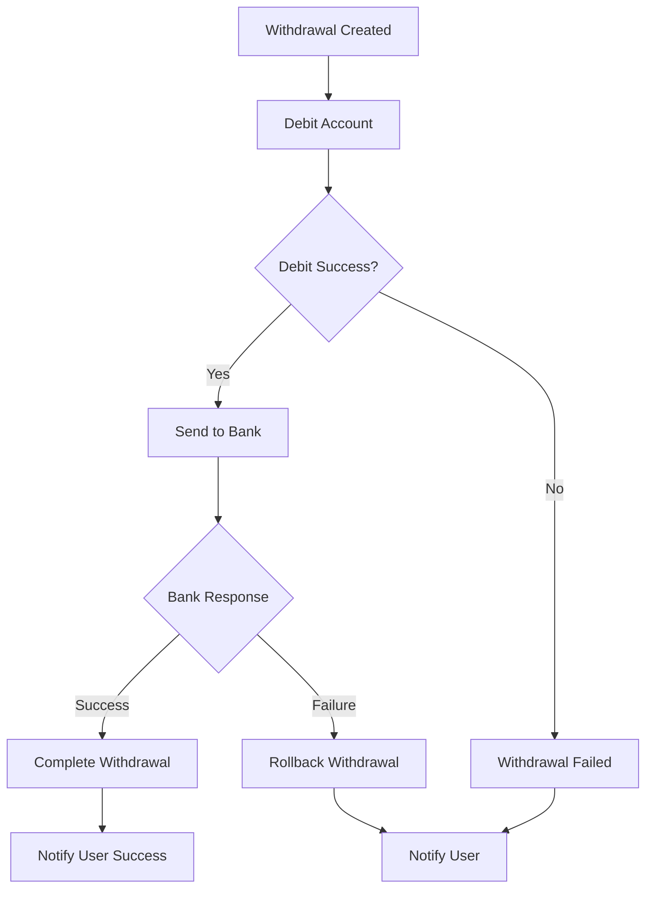

# Withdrawal Saga Pattern

## 🎯 Overview

The Withdrawal Saga orchestrates the complete withdrawal process from creation to completion or failure. It uses the Saga pattern to manage complex business processes that span multiple bounded contexts.

## 🔄 Saga Flow



## 📋 Events and Commands

### Events (What Happened)
- `WithdrawalCreatedEvent` - Withdrawal request created
- `WithdrawalDebitedEvent` - Account successfully debited
- `WithdrawalSentToBankEvent` - Transfer sent to bank
- `BankTransferCompletedEvent` - Bank confirmed transfer
- `WithdrawalFailedEvent` - Process failed at any step

### Commands (What to Do)
- `DebitAccountCommand` - Debit the user's account
- `SendToBankCommand` - Send transfer to bank
- `CompleteWithdrawalCommand` - Mark withdrawal as completed
- `RollbackWithdrawalCommand` - Rollback failed transaction

## 🏗️ Implementation Benefits

### 1. **Decoupling**
- Each step is independent
- Easy to add/remove steps
- Clear separation of concerns

### 2. **Error Handling**
- Automatic rollback on failures
- Compensating transactions
- Event-driven error recovery

### 3. **Scalability**
- Each command can be handled by different services
- Easy to add retry logic
- Supports distributed systems

### 4. **Testability**
- Each step can be tested independently
- Easy to mock events and commands
- Clear input/output contracts

## 🚀 Usage Example

```typescript
// 1. Create withdrawal (triggers saga)
const withdrawal = await withdrawalService.createWithdrawal(
  userId, 
  accountId, 
  bankAccountId, 
  amount
);

// 2. Saga automatically handles:
// - DebitAccountCommand
// - SendToBankCommand  
// - CompleteWithdrawalCommand
// - Or RollbackWithdrawalCommand on failure
```

## 🔧 Configuration

To use the saga, add the `WithdrawalSagaModule` to your application:

```typescript
@Module({
  imports: [
    WithdrawalSagaModule,
    // ... other modules
  ],
})
export class AppModule {}
```

## 📊 Monitoring

The saga provides comprehensive logging:

```typescript
// Each step logs its progress
console.log('🔄 Withdrawal Saga: Starting withdrawal process for ID:', withdrawalId);
console.log('🔄 Withdrawal Saga: Account debited, sending to bank for ID:', withdrawalId);
console.log('🔄 Withdrawal Saga: Withdrawal sent to bank, waiting for response for ID:', withdrawalId);
console.log('🔄 Withdrawal Saga: Bank transfer completed, finalizing withdrawal for ID:', withdrawalId);
```

## 🛠️ Extending the Saga

To add new steps:

1. **Create new events and commands**
2. **Add new saga methods**
3. **Update the flow diagram**
4. **Add tests for new scenarios**

Example:
```typescript
@Saga()
newStep = (events$: Observable<IEvent>): Observable<ICommand> => {
  return events$.pipe(
    ofType(PreviousStepEvent),
    map((event: PreviousStepEvent) => {
      return new NextStepCommand(event.data);
    })
  );
};
```

## 🧪 Testing

Test the saga by:
1. Publishing events
2. Verifying commands are generated
3. Testing error scenarios
4. Validating rollback behavior

```typescript
// Test successful flow
const event = new WithdrawalCreatedEvent(...);
eventBus.publish(event);
// Verify DebitAccountCommand is generated

// Test failure flow  
const failureEvent = new WithdrawalFailedEvent(...);
eventBus.publish(failureEvent);
// Verify RollbackWithdrawalCommand is generated
```
